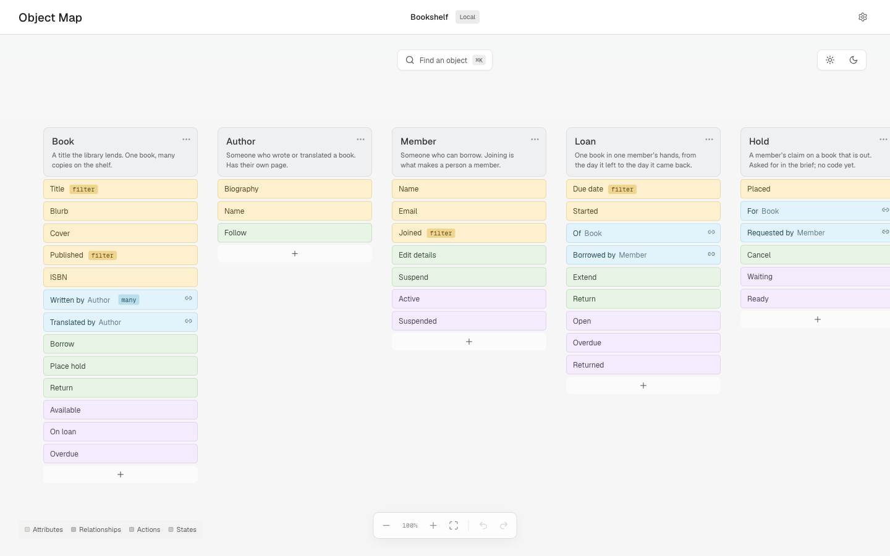

# Object Map

As coding agents grow more capable, maintaining visibility into what is actually being built becomes increasingly difficult. Domain logic, data structures, and feature choices quickly get fragmented across long chat histories, PRDs, pull requests, and generated code. When you hand an agent a prompt and say "build this," it is easy to lose track of your system's core primitives.

Object Map gives you and your coding agent a shared, continuously updated single source of truth. Your agent reads the repository — routes, forms, schemas, services, tests — and records the core building blocks of your product: objects, attributes, relationships, actions, and states. The model follows [Object-Oriented UX](https://alistapart.com/article/object-oriented-ux/) (OOUX), Sophia Prater's method for describing a product by the things its users recognize rather than by its screens.

Instead of digging through chat logs or reading thousands of lines of generated code, you get a visual canvas to inspect, refine, and discuss your product structure directly with your agent.



## Core Concepts

Object Map shows your product as the things it is made of, in columns you can read side by side. Each object is one thing (or concept) a user would recognize, and can have up tp five kinds of structure:

- **Object**: A core noun in your product that users recognize and interact with (e.g., Book, Author, Member).
- **Attributes**: Properties that describe the object (e.g., Title, ISBN, Publish Date).
- **Relationships**: Directional connections between objects (e.g., a Book is Written by an Author).
- **Actions**: Operations users can perform on or with the object (e.g., Borrow, Renew, Archive).
- **States**: Lifecycle stages an object moves through (e.g., Available, On Loan, Overdue).

Concepts present in your brief but not yet implemented in code remain on the map as unbuilt items, allowing you to design the product before writing code.

## Quick Start

### 1. Install

Requires Node 20 or newer (`node --version`). From inside the repository you want mapped:

```bash
curl -fsSL https://github.com/MetaHeavies/object-map/releases/latest/download/object-map-skill.tgz | tar xz -C /tmp
node /tmp/object-map/scripts/install.mjs .
```

The skill unpacks to `/tmp`, so the only things added to your repository are the files listed below. To install into a different repository, pass its path instead of `.`.

### 2. Launch the Canvas

Start the local server from the same repository:

```bash
node .agents/skills/object-map/scripts/serve.mjs
```

### 3. Prompt Your Agent

Once installed, share this prompt with your agent:

> Run Object Map on this repository. Inspect the implementation, populate the map, and report any missing concepts or ambiguities.

For a new project without existing code, point the agent at your spec or product brief. The agent will map your intended architecture side-by-side with your code as you build.

## System Requirements & Integration

- **Language Agnostic**: Your agent reads your code. Object Map never parses or runs it. Your product can be written in Python, Ruby, Go, PHP, TypeScript, or any other stack.
- **Node Runtime**: Node 20 or newer is only required locally on your machine to run the installer and canvas server. It adds no dependencies to your project's `package.json` or build process.
- **Agent Support**: Configures hooks automatically for Claude Code and Codex (use `--hosts=claude` or `--hosts=codex` to specify one). For other agents, standard instructions are added to `AGENTS.md`.

## What Gets Added to Your Project

Installation adds local configuration and agent instructions without altering your application code:

| Path | Purpose |
| --- | --- |
| `.object-map/` | Saved map data, canvas layout, and local settings |
| `.agents/skills/object-map/` | Skill instructions, helper scripts, and canvas interface |
| `.claude/skills/object-map/` | Claude Code skill integration |
| `AGENTS.md`, `CLAUDE.md` | Instruction blocks appended for agent context |
| `.claude/settings.json`, `.codex/hooks.json` | Hooks for automatic map synchronization |

To uninstall, delete these directories and remove the marked blocks from your markdown and settings files.

## Demo Mode

To test Object Map without modifying a project:

```bash
node .agents/skills/object-map/scripts/serve.mjs --demo
```

This launches a pre-populated example library project ("Bookshelf"). It is copied to a temporary directory first, so nothing you change there touches your own repository.

## Canvas Controls

- **Focus View**: Click an object header to isolate its connections. Click the background or press Escape to reset.
- **Edit & Rename**: Double-click any label or press F2 to edit.
- **Add Elements**: Click + at the bottom of a column to add attributes, relationships, actions, or states. To draft a whole object before building it, ask your agent to add it. It stays on the map as unbuilt until code exists.
- **Refactor**: Promote an attribute into its own object or demote an object back to an attribute using the item menu.
- **Shortcuts**: Cmd/Ctrl + Z (Undo), Shift + Cmd/Ctrl + Z (Redo), F (Fit map to screen), Cmd/Ctrl + K (Search objects).

Edits save automatically to `.object-map/map.json`. The canvas updates live when your coding agent modifies the structure.

## How It Stays Current

The map is a plain JSON file in your repository, `.object-map/map.json`, which your agent reads and writes through the installed skill. Installation registers three **hooks** so that keeping it current does not depend on the agent remembering to. A hook is a short command your agent host runs by itself at a fixed point in a session. Object Map configures its three in `.claude/settings.json` and `.codex/hooks.json`:

- **SessionStart**: Fires when a session begins. Puts the current map in front of your agent. It starts from your model and your names instead of re-deriving them from the code.
- **UserPromptSubmit**: Fires on every prompt you send. Re-supplies the map so it stays in context through a long session.
- **Stop**: Fires when your agent finishes a turn. If implementation files changed and the map did not, it names those files and asks for the model to be reconciled. It does this once per turn at most, and says nothing when neither changed.

You and your agent can both be working at once. Saves are revision-checked, so a write from a stale copy is rejected rather than overwriting newer work.

The hooks make sure your agent has the map and notices when it is out of date. They cannot check whether the map is correct. You do that by reading the canvas, which is why the install prompt asks your agent to report what it was unsure about.

If the hooks do not appear to fire, run `node .agents/skills/object-map/scripts/map.mjs doctor` in your repository. It lists every file the install wrote and marks any that are missing. Files on disk do not prove your host loaded them. Restart or re-trust the host, then check whether a fresh prompt carries the map.

## Development

Building from source needs Node 22.12 or newer, which is Vite's floor rather than the skill's.

```bash
npm install
npm run dev
```

The dev server runs on http://127.0.0.1:5173. Set `OBJECT_MAP_REPO` to the repository you want it to open. With none set it opens an empty scratch repository.

Background documents live in `docs/`: the [open questions](docs/product-questions.md) behind the current design.

### Testing & Packaging

```bash
npm test
npm run build
npm run package:skill
```

## Current Boundary

Object Map is in beta. Known limits:

- **Drift detection is mechanical, not semantic.** The Stop hook sees that implementation files changed while the map did not. It cannot tell you that a name on the map has become wrong.
- **No parser ships with it.** There is no built-in schema reader. A schema reader would only see schema-backed products, and it cannot tell a product object from a database table. Your agent reads the code, and you check the result.
- **You cannot create an object from the canvas.** You can add attributes, relationships, actions and states to an object that exists. A new object comes from your agent.
- **Windows and host activation are unverified.** Development and testing ran on macOS, with Claude Code and Codex. Report what happens elsewhere.
- **One request leaves your machine.** There are no accounts, no cloud storage, no telemetry and no generated product code. Object Map writes files in your repository and serves the canvas on 127.0.0.1. The canvas loads its typeface from Google Fonts. That is the only external request it makes.

## License

MIT. See [LICENSE](LICENSE).
